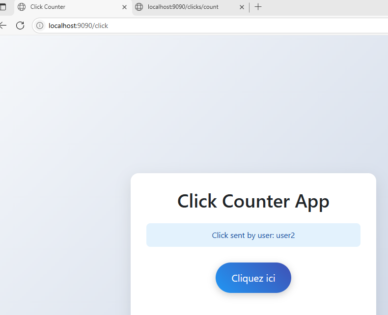
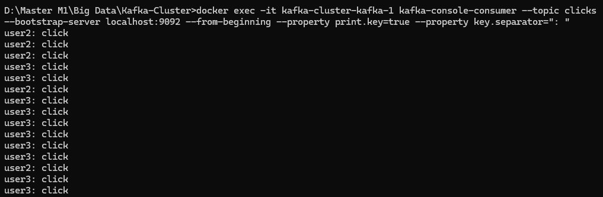
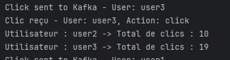

# Calcul du nombre de clics avec Kafka Streams et Spring Boot

## 📋 Description

Ce projet propose une solution complète basée sur **Kafka Streams** et **Spring Boot** pour suivre et analyser les clics des utilisateurs en temps réel.  
Il se compose de trois parties principales :

1. **Producteur Web** : une interface avec un bouton "Cliquez ici", chaque clic est envoyé à Kafka.
2. **Application Kafka Streams** : traitement des clics pour compter leur nombre en temps réel.
3. **Consommateur REST** : expose une API pour consulter les résultats via un endpoint HTTP.

> Objectif : comprendre l’architecture orientée événements avec Kafka & Spring Boot.

---

## 🚀 Fonctionnalités

### ✅ Producteur Web
- Application Spring Boot avec interface web (bouton "Cliquez ici").
- Chaque clic envoie un message à Kafka avec une clé (`userId`) et une valeur (`"click"`).
- Les messages sont envoyés dans le topic Kafka : `clicks`.

### ✅ Application Kafka Streams
- Consomme les messages du topic `clicks`.
- Compte dynamiquement les clics (globaux ou par utilisateur).
- Envoie les résultats dans le topic `click-counts`.

### ✅ Consommateur REST
- Application Spring Boot consommant le topic `click-counts`.
- API REST exposant le total des clics en temps réel :
  GET /clicks/count

---
## 🧰 Prérequis

- Docker & Docker Compose
- Java 11+
- Maven ou Gradle
- Kafka (via docker-compose)

---

## 🛠️ Installation & Lancement

### 1. Lancer le cluster Kafka avec Docker

```bash
docker-compose up -d
2. Créer les topics Kafka

docker exec -it kafka-cluster-kafka-1 kafka-topics --create --topic clicks --bootstrap-server localhost:9092 --partitions 3 --replication-factor 1

docker exec -it kafka-cluster-kafka-1 kafka-topics --create --topic click-counts --bootstrap-server localhost:9092 --partitions 3 --replication-factor 1
3. Consommer les topics (pour vérification)
🔹 Topic clicks (clics bruts)

docker exec -it kafka-cluster-kafka-1 kafka-console-consumer \
  --topic clicks \
  --bootstrap-server localhost:9092 \
  --from-beginning \
  --property print.key=true \
  --property key.separator=": "
🔹 Topic click-counts (comptes agrégés)

docker exec -it kafka-cluster-kafka-1 kafka-console-consumer \
  --topic click-counts \
  --bootstrap-server localhost:9092 \
  --from-beginning
➡️ Pour quitter le mode consommateur Kafka : CTRL+C
```
🖼️ Captures d’écran

### Interface Web (localhost)	



### Consumer Kafka 	


### Terminal Docker Kafka Cluster


---

# 👤 Auteur

### Mouad Dacheikh